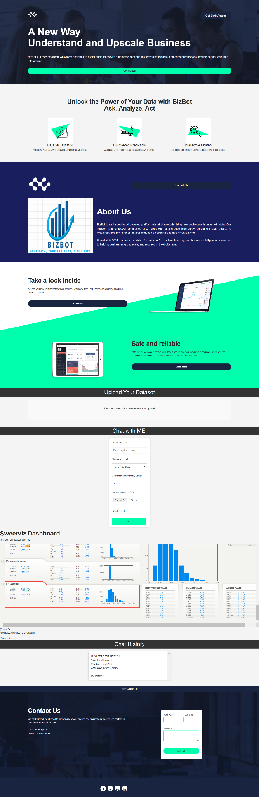
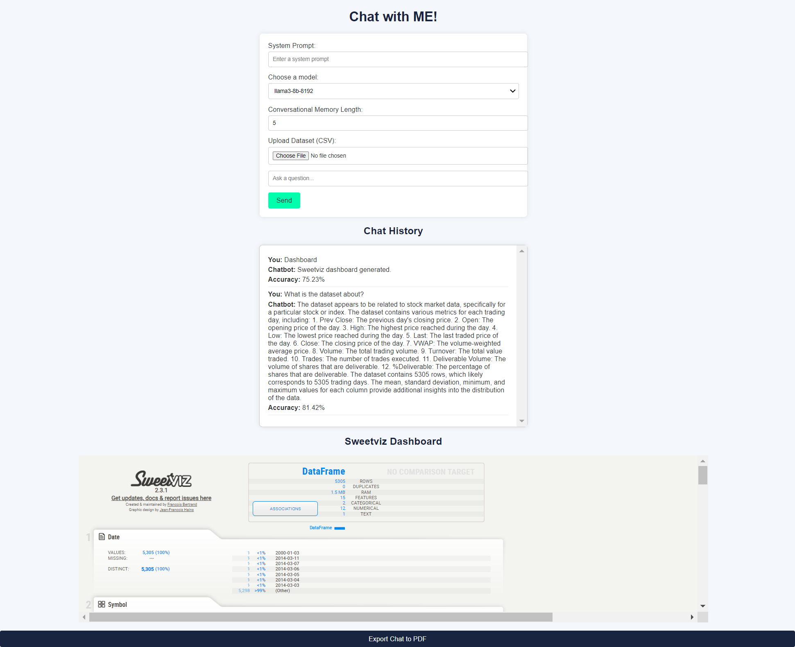

# BizBot Web Application

BizBot is an AI-powered conversational web application designed to assist businesses in exploring their data through natural language queries, generating insights, and creating visualizations. The platform integrates advanced machine learning models and conversational AI for enhanced decision-making.

### Features

1) AI-Powered Chatbot: Interact with the chatbot to ask business-related queries.
2) Dataset Upload: Upload CSV files and explore the data.
3) Data Visualization: Generate charts and graphs like heatmaps and pair plots.
4) Sweetviz Dashboard: Automatically create a detailed Sweetviz report.
5) Model Training and Predictions: Train models like Logistic Regression, Random Forest, and SVC, and use them for predictions.
6) Export Reports: Export chat conversations to PDF.
7) Contact Form: Reach out for queries and support.

### Pre-requisites

Ensure you have the following installed:

1) Python 3.8 or higher
2) pip (Python package manager)

### 


### Installation

Clone the repository:

```bash
git clone https://github.com/your-username/bizbot-webapp.git
cd bizbot-webapp

```
Install the required dependencies:

```bash
pip install -r requirements.txt

```
Set up the directories:
```bash
mkdir static/uploads

```
Replace the placeholder groq_api_key in the code with your actual Groq API key.
### Deployment

Run the Flask application:

```bash
python app.py

```
Open your browser and navigate to:

```arduino
http://127.0.0.1:5000


```
### File Structure

1) index.html: Main front-end interface with upload, chat, and dashboard features.
2) app.py: Core application logic for handling requests, managing datasets, and integrating with Groq API.
3) chatbot.py: Backend logic for LLM interaction, model training, and plotting.
4) requirements.txt: Dependencies required to run the application.
style.css: Custom styling for the front-end.

### Libraries used

1) Flask: Web framework
2) pandas: Data manipulation
3) matplotlib & seaborn: Data visualization
4) sweetviz: Automated exploratory data analysis
5) fpdf: PDF generation
6) langchain: Conversational AI logic
7) scikit-learn: Machine learning models

### Key Features and How They Work

1) Dataset Upload:

i) Supports CSV files.
ii) Automatically generates summary statistics and visualizations.

2) Visualization:

i) Supports heatmaps, pair plots, and histograms.
ii) Uses Matplotlib and Seaborn for rendering.

3) Chatbot:

i) Integrates Groq-based LLM for contextual responses.
ii) Supports queries related to uploaded datasets.

4) Model Training:
i) Supports Logistic Regression, Random Forest, and more.
ii) Includes hyperparameter tuning with GridSearchCV.

5) Sweetviz Dashboard:
i) Generates an HTML report summarizing the dataset.

## Screenshots





## Feedback

If you have any feedback, please reach out to us at saailtayshete289@gmail.com 

